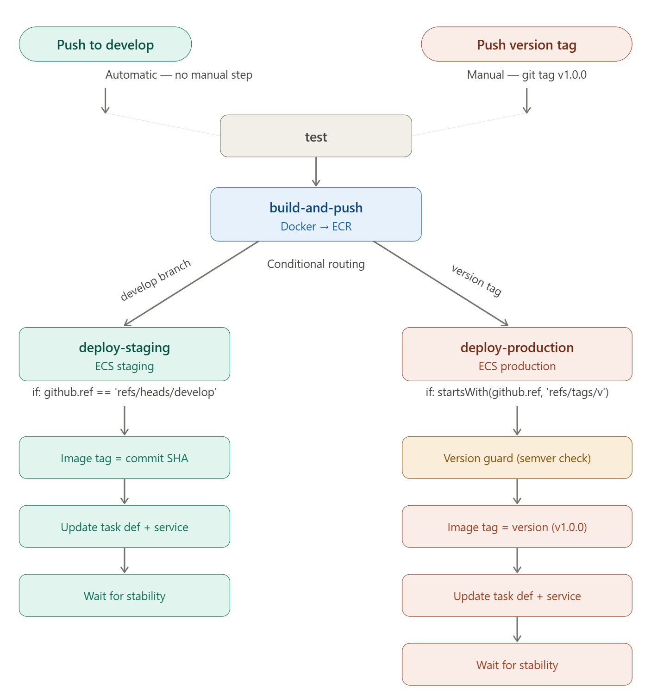

# GitHub CI/CD Workflow Documentation

## Overview

This repository contains a comprehensive **GitHub Actions CI/CD Pipeline** that automates testing, building, and deployment processes. The workflow handles the full lifecycle from code commit to production deployment.



---

## 📋 Workflow Features

The CI/CD pipeline includes the following automated processes:

### 1. **Testing**
   - Runs the test suite automatically on every push
   - All downstream jobs depend on tests passing
   - Ensures code quality before building

### 2. **Building & Docker Image Push**
   - Automatically builds Docker images
   - Pushes images to Amazon ECR (Elastic Container Registry)
   - Smart tagging strategy:
     - **Version tags** (e.g., `v1.0.0`): Image tagged with version number
     - **Develop commits**: Image tagged with commit SHA

### 3. **Staging Deployment**
   - Triggered on pushes to the `develop` branch
   - Deploys to staging ECS environment
   - Uses the latest commit SHA image tag

### 4. **Production Deployment**
   - Triggered on version tag pushes (e.g., `v1.0.0`)
   - Includes version guard to prevent deploying older versions over newer ones
   - Ensures production stability and rollback safety

---

## 🚀 Workflow Triggers

| Trigger | Action | Destination |
|---------|--------|-------------|
| Push to `develop` branch | Test → Build → Deploy | Staging |
| Push version tag `v*.*.*` | Test → Build → Version Guard → Deploy | Production |

---

## 🔄 Complete Pipeline Flow

```
Code Push
    ↓
├─ Test Job (ubuntu-latest)
│   └─ Checkout code
│      
└─ Build & Push Job (depends on Test ✓)
   ├─ Checkout code
   ├─ Configure AWS Credentials
   ├─ Login to Amazon ECR
   └─ Build, Tag & Push Docker Image
      
└─ Deploy to Staging (if develop branch)
   ├─ Fetch current task definition
   ├─ Update container image
   ├─ Register new task definition
   ├─ Update ECS service
   └─ Wait for stabilization
   
└─ Deploy to Production (if version tag)
   ├─ Version guard check
   ├─ Fetch task definition
   ├─ Update container image
   ├─ Register new revision
   └─ Update ECS service
```

---

## 🔑 Required Secrets & Variables

To use this workflow, configure the following in your GitHub repository settings:

### **Secrets** (GitHub Repository → Settings → Secrets and variables → Actions)
- `AWS_ACCESS_KEY_ID`: AWS IAM access key for authentication
- `AWS_SECRET_ACCESS_KEY`: AWS IAM secret access key
- `ECR_REPOSITORY`: Amazon ECR repository URL

### **Variables** (GitHub Repository → Settings → Secrets and variables → Actions)
- `AWS_REGION`: AWS region (e.g., `us-east-1`)

---

## 📝 Getting Started

### 1. **Clone the Repository**
```bash
git clone <repository-url>
cd GithubWorkflow-CICD
```

### 2. **Create Deployment Branch**
```bash
git checkout -b deployment_instruction
```

### 3. **Configure AWS Credentials**
- Navigate to GitHub repository Settings
- Add AWS credentials and ECR repository URL as secrets
- Add AWS region as a variable

### 4. **Push Code**
```bash
# For staging deployment
git push origin develop

# For production deployment with version tag
git tag v1.0.0
git push origin v1.0.0
```

---

## 🛡️ Safety Features

### Production Version Guard
The workflow includes a built-in safety mechanism that prevents deploying older versions over newer ones:
- Checks the current version running in production
- Compares with the new version being deployed
- Blocks deployment if attempting to deploy an older version (e.g., pushing `v0.0.4` after `v0.0.5`)

---

## 📊 Job Dependencies

```
Test Job ✓
    ↓
Build & Push Job (waits for Test to pass)
    ↓
Deploy Job (waits for Build to succeed)
```

Each job must complete successfully before the next job begins, ensuring a safe progression through the pipeline.

---

## 🐳 Docker Image Tagging Strategy

| Scenario | Image Tag | Used For |
|----------|-----------|----------|
| Push to `develop` | Commit SHA (e.g., `abc123def`) | Staging tests |
| Push version tag | Version number (e.g., `v1.0.0`) | Production release |

---

## 🔗 Related Files

- **ci-cd.yml**: The GitHub Actions workflow configuration file containing all job definitions
- **test.py**: Sample test file for the project
- **Dockerfile**: (Required) Must be in the repository root for Docker image builds

---

## 📞 Support

For issues or questions about this CI/CD workflow:
1. Check the GitHub Actions logs in the repository
2. Review the ci-cd.yml file for job details
3. Verify all secrets and variables are correctly configured

---

## 📄 License

This workflow is part of the GithubWorkflow-CICD repository. Please ensure compliance with your project's license agreement.
